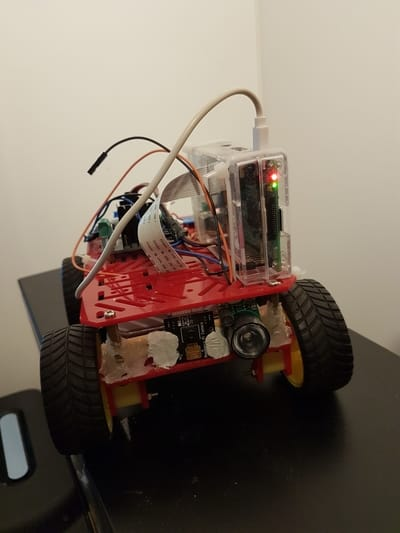
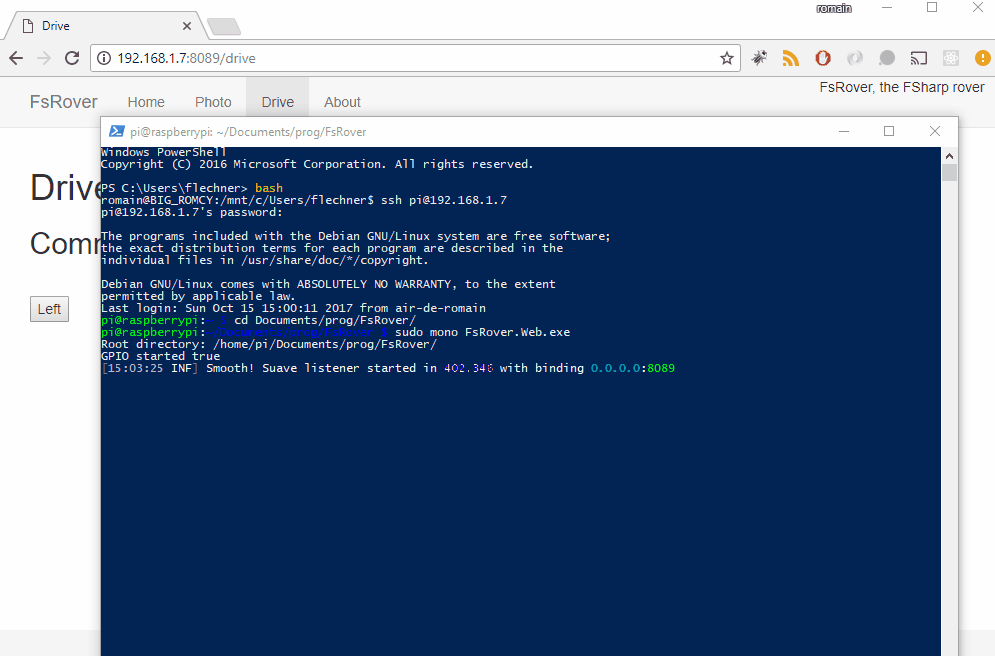

# FsRover

## Raspberry PI robot powered with FSharp

I made this small project to demonstrate that FSharp can be used for robotic and domotics projects.

## Technologies used for software

- [FSharp on linux](http://fsharp.org/use/linux/)
- [Suave.io](https://suave.io)
- [WebSharper](https://websharper.com)
- [libraspicamcv](https://github.com/robidouille/robidouille/tree/master/raspicam_cv)
- [OpenCvInterop.fs is port of CvInvokeRaspiCamCV.cs in PiCamCV](https://github.com/neutmute/PiCamCV/blob/master/source/LibPiCamCV/PInvoke/CvInvokeRaspiCamCV.cs)

## Hardware

- [Raspberry PI 3](https://hackspark.fr/fr/raspberrypi-3-modele-b-raspberry-pi-quad-core-64bit-wifi-bluetooth-4-0-1gb-ram.html)
- Power bank 12000 mah with 2 USB ports
- [L298 Dual H-Bridge Motor Driver](https://hackspark.fr/fr/l298-dual-h-bridge-motor-driver.html)
- [Camera module](https://hackspark.fr/fr/raspberry-pi-camera-noir-no-ir-filter-version-night-vision-version.html)
- [A chassis](http://www.dx.com/p/16-in-1-smart-car-chassis-kit-for-arduino-black-yellow-153073)

## Wiring

While waiting for the schemas (in progress), you can see photographies [here](images/hd)

### GPIO

#### Pins

- Pin1: GPIO26
- Pin2: GPIO19
- Pin3: GPIO13
- Pin4: GPIO6

#### Physical actions

- Forward: Pin1 and Pin3
- Backward: Pin2 and Pin4
- Left: Pin2 and Pin3
- Right: Pin1 and Pin4

## Self hosted web site

### Run on your RPI

- Build locally with `build.bat`
- Upload `release` folder up to your RPI
- Run `sudo mono FsRover.Web.exe`

